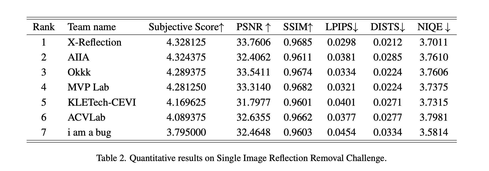
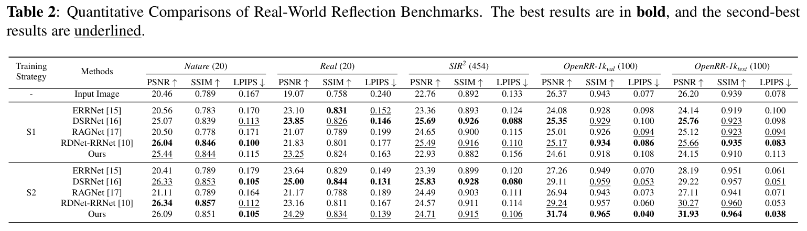

# OpenRR-1k: A scalable dataset for real-world reflection removal


## Dataset
The dataset is available on Hugging Face 🤗:
[OpenRR-1k Dataset](https://huggingface.co/datasets/qiuzhangTiTi/NTIRE2025-SIRR)

The dataset contains:
- `train_800.zip`: Contains both Input images and Ground Truth (GT)
- `val_100.zip`: Contains both Input images and Ground Truth (GT)
- `test_100.zip`: Contains both Input images and Ground Truth (GT)


## NTIRE 2025 - SIRR in the Wild: Final Ranking



## ICIP 2025: Real-World Reflection Benchmarks



## 📢 **Repository Renamed**

This repository was previously named **`Reflection-Removal-in-the-Wild`**, and has been renamed to **`OpenRR-1k`** to better reflect its scope as an open benchmark for real-world reflection removal.

All previous links to the old repository name will continue to work via GitHub redirection.


## Citation

If you find our code helpful in your research or work please cite our paper.

```bibtex
@misc{yang2025surveysingleimagereflectionremoval,
      title={Survey on Single-Image Reflection Removal using Deep Learning Techniques}, 
      author={Kangning Yang and Huiming Sun and Jie Cai and Lan Fu and Jiaming Ding and Jinlong Li and Chiu Man Ho and Zibo Meng},
      year={2025},
      eprint={2502.08836},
      archivePrefix={arXiv},
      primaryClass={cs.CV},
      url={https://arxiv.org/abs/2502.08836}, 
}
```
```bibtex
@InProceedings{Yang_2025_CVPR,
    author    = {Yang, Kangning and Cai, Jie and Ouyang, Ling and Vasluianu, Florin-Alexandru and Timofte, Radu and Ding, Jiaming and Sun, Huiming and Fu, Lan and Li, Jinlong and Ho, Chiu Man and Meng, Zibo and Li, Mingjia and Wang, Hainuo and Hu, Qiming and Wang, Jiarui and Zhao, Hao and Hu, Jin and Guo, Xiaojie and Yang, Mengru and He, Jing and Wang, Yiqing and Chen, Zhiyang and Fang, Hao and Zhang, Wei and Cong, Runmin and Hegde, Dheeraj Damodhar and Kalal, Jatin and Akalwadi, Nikhil and Tabib, Ramesh Ashok and Mudenagudi, Uma and Lin, Yu-Fan and Lee, Chia-Ming and Hsu, Chih-Chung and Zhang, Mengxin and Nathan, Sabari and Uma, K and Sasithradevi, A and Bama, B Sathya and Roomi, S. Mohamed Mansoor and Benjdira, Bilel and Ali, Anas M. and Boulila, Wadii and Dong, Wei and Li, Yunzhe and Hussein, Ali and Zhou, Han and Chen, Jun and Xiao, Zeyu and Li, Zhuoyuan},
    title     = {NTIRE 2025 Challenge on Single Image Reflection Removal in the Wild: Datasets, Methods and Results},
    booktitle = {Proceedings of the Computer Vision and Pattern Recognition Conference (CVPR) Workshops},
    month     = {June},
    year      = {2025},
    pages     = {1301-1311}
}
```
```bibtex
@misc{yang2025openrr1kscalabledatasetrealworld,
      title={OpenRR-1k: A Scalable Dataset for Real-World Reflection Removal}, 
      author={Kangning Yang and Ling Ouyang and Huiming Sun and Jie Cai and Lan Fu and Jiaming Ding and Chiu Man Ho and Zibo Meng},
      year={2025},
      eprint={2506.08299},
      archivePrefix={arXiv},
      primaryClass={cs.CV},
      url={https://arxiv.org/abs/2506.08299}, 
}
```